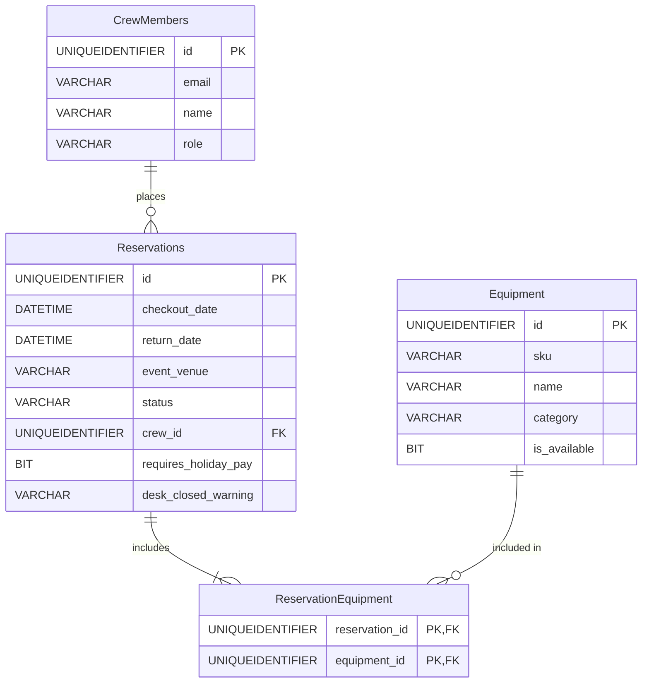

# A/V Equipment Vault - Backend Development Final Project

**Live GraphQL API:** [itmd544final-b5fcg7aneggfenct.westus3-01.azurewebsites.net/graphql](https://itmd544final-b5fcg7aneggfenct.westus3-01.azurewebsites.net/graphql)  
**Live REST API Docs:** [itmd544final-b5fcg7aneggfenct.westus3-01.azurewebsites.net/docs](https://itmd544final-b5fcg7aneggfenct.westus3-01.azurewebsites.net/docs)  
**Live Frontend Demo:** [itmd544final-b5fcg7aneggfenct.westus3-01.azurewebsites.net/client](https://itmd544final-b5fcg7aneggfenct.westus3-01.azurewebsites.net/client)  

A full backend system for managing professional audio/visual equipment vault for my final assignment for ITMD544.


## System Architecture & Tech Stack
This Node.js application is deployed to an Azure Web App Service and communicates with an Azure SQL Database. 

- **Runtime:** Node.js / TypeScript
- **Server:** Express.js & Apollo Server
- **Database:** Azure SQL Database (Serverless)
- **Deployment:** Azure App Service + GitHub Actions CI/CD
- **Containerization:** Docker (Multi-stage `Dockerfile` included)
- **Testing:** Jest + Supertest
- **Logging:** Winston + Morgan

## Database Design
The system uses a Azure SQL database with 4 interconnected tables and complex relationships. It connects directly via the `mssql` ADO.NET equivalent package.

### Schema Details

1. **CrewMembers**: Information regarding internal staff (ID, email, name, role).
2. **Equipment**: Available A/V gear inventory (ID, sku, name, category, is_available).
3. **Reservations**: Checkout and return dates mapped to a specific CrewMember and Event Venue.
4. **ReservationEquipment**: A combo/junction table linking multiple Equipment items to a single Reservation, creating a "many to many" relationship.



Data integrity is done using SQL constraints (Primary Keys, Foreign Keys, non-null fields) and API validation.

## API Development
The application has both a REST API and a GraphQL API. Both provide full CRUD functionality.

- **REST API:** Available at `/api` (`/api/crew`, `/api/equipment`, `/api/reservations`).
- **GraphQL API:** Available at `/graphql`.
- **API Documentation:** Interactive Swagger/OpenAPI documentation is available at `/docs`, and GraphQL is available at `/graphql`.

## External API Integration
The third party api that I used for this assignment was [Nager.Date API](https://date.nager.at/). 

When a reservation is created, the system checks and return dates to the Nager.Date US Public Holidays endpoint. If the reservation falls on a recognized holiday, the API flags the database record as `requires_holiday_pay` and appends a `desk_closed_warning` string containing the name of the specific holiday.

## Frontend Demonstration
A simple web page is included to demonstrate API usage.
- Uses the endpont `/client`.
- Uses basic HTML/JS to fetch data from the backend.
- Demonstrates full CRUD capabilities, including inline form editing for Crew and Equipment, and features a "Reset Database" utility button to wipe and re-seed the tables with test data.

## Technical Implementation Details
- **Logging:** `winston` is configured for structured application logging, along with `morgan` to log all incoming HTTP requests automatically.
- **Testing:** Unit and integration testing is handled by `jest` and `supertest`, which verify the REST API routes.
- **CI/CD:** A GitHub Actions workflow (`.github/workflows/main_itmd544final.yml`) runs on every push to `main`. It automatically installs dependencies, runs the `jest` test suite, builds the TypeScript code, and deploys the artifact to Azure App Service.
- **Containerization:** A `Dockerfile` and `.dockerignore` are included in the root directory for standard containerized deployment.


## Setup and Installation Instructions

### Local Development Environment

1. **Clone the repository:**
   ```bash
   git clone https://github.com/DominikFX/ITMD544-final.git
   cd ITMD544-final
   ```

2. **Install Dependencies:**
   ```bash
   npm install
   ```

3. **Configure the Environment:**
   Create a `.env` file in the root of the project:
   ```bash
   cp .env.example .env
   ```
   *If testing locally, replace the placeholders in the `.env` file with your Azure SQL credentials and add the IP to the SQL datbase server*

4. **Initialize the Database:**
   ```bash
   npx ts-node src/db/init.ts
   ```

5. **Run the Server:**
   ```bash
   npm run dev
   ```

6. **Run the Test Suite:**
   ```bash
   npm run test
   ```

### Deployment Instructions
This application is configured for Continuous Deployment via GitHub Actions.
1. Create a Node.js Web App in Azure App Service.
2. **Configuration -> Application settings**, add your `DB_CONNECTION_STRING`.
3. Link the repository via the Deployment Center, and GitHub Actions will automatically handle testing, building, and deploying.

You can also build and run the Docker container locally:
```bash
docker build -t av-manager-api .
docker run -p 4000:4000 --env-file .env av-manager-api
```

## Future Improvement Suggestions
- **Authentication/Authorization:** Implement authentication tokens to restrict access to specific operations (for ex: only Managers can delete equipment).
- **Better UI** Create a more user-friendly interface for the frontend and backend, including proper error handling and user feedback.