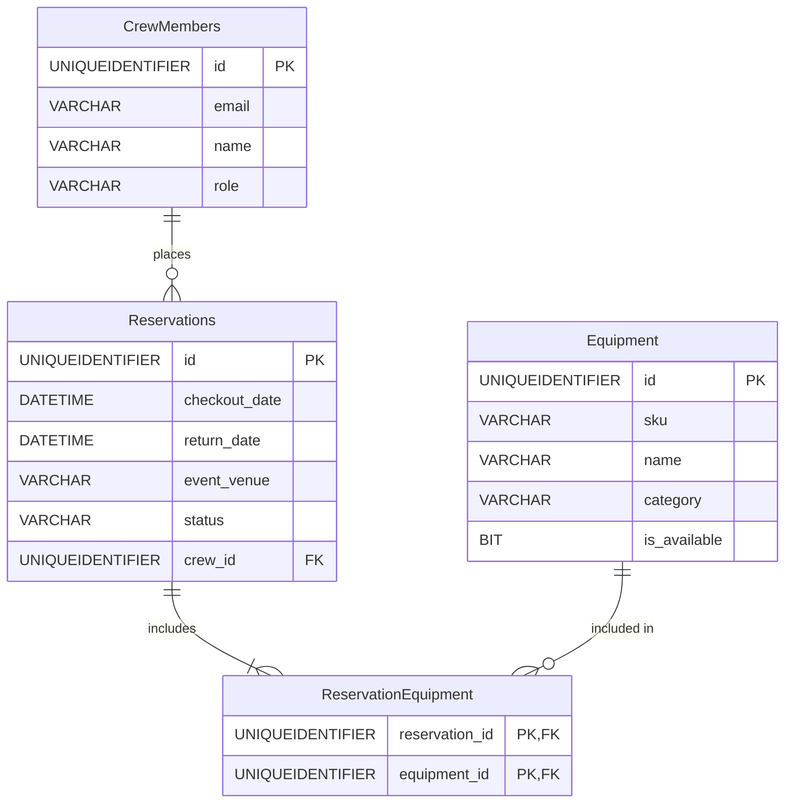

# Professional A/V Equipment Vault API
## ITMD544 - API Development Assignment

A backend GraphQL API for managing a professional audio/visual equipment vault. This project is the first part that will be used for the final assignment that is deployed to azure. This project focuses on cloud deployment, and direct database integration using Node.js and Azure SQL.

**Live GraphQL API:** [https://itmd544-apidev-h9f0h3gderesc3b0.westus3-01.azurewebsites.net/graphql](https://itmd544-apidev-h9f0h3gderesc3b0.westus3-01.azurewebsites.net/graphql)  
**GitHub Repository:** [https://github.com/DominikFX/ITMD544-api-dev](https://github.com/DominikFX/ITMD544-api-dev)

## Features & Implementation (Phases 1 & 3)

This project combines Phase 1 (Database Integration) and Phase 3 (GraphQL API Implementation) requirements:
- **Direct Database Access:** Utilizes the `mssql` (ADO.NET equivalent for Node.js) package to connect directly to an Azure SQL Serverless database without using an ORM.
- **Relational Schema:** Implements a multi table relational structure with cross table relationships.
- **GraphQL Engine:** Express and Apollo Server for a strongly-typed API.
- **Limitations:** Implemented retry logic on database connections to handle since the free tier of Azure SQL Database needs time to "wake up".

## Tech Stack

- **Runtime:** Node.js / TypeScript
- **Server:** Express.js + Apollo Server 4
- **Database:** Azure SQL Database (Serverless, Free Tier)
- **Deployment:** Azure App Service (Web App)

## System Architecture & Database Schema

The database consists of the following core tables:

1. **CrewMembers**: Information regarding internal staff (ID, email, name, role).
2. **Equipment**: Available A/V gear inventory (ID, sku, name, category, is_available).
3. **Reservations**: Checkout and return dates mapped to a specific CrewMember and Event Venue.
4. **ReservationEquipment**: A combo table linking multiple Equipment items to a single Reservation.



## Local Setup Instructions

1. **Clone the repository:**
   ```bash
   git clone https://github.com/DominikFX/ITMD544-api-dev.git
   cd ITMD544-api-dev
   ```

2. **Install Dependencies:**
   ```bash
   npm install
   ```

3. **Configure the Environment:**
   Create a `.env` file in the root of the project using the `.env.example` template:
   ```bash
   cp .env.example .env
   ```
   *Replace the placeholders in the `.env` file with your actual Azure SQL credentials.*

   > **Note:** Because the database is hosted on Azure SQL, ensure that your current local IP address is whitelisted in the Azure Portal Firewall settings, or your connection will time out.

4. **Initialize the Database:**
   If the database is empty, run the initialization script to generate the tables:
   ```bash
   npx ts-node src/db/init.ts
   ```

5. **Run the Development Server:**
   ```bash
   npm run dev
   ```
   The API and Apollo Sandbox will be available at `http://localhost:4000/graphql`.

## API Usage Examples

You can execute queries directly in the Apollo Sandbox UI at the link above.

### 1. Create a Crew Member (Mutation)
```graphql
mutation {
  createCrewMember(email: "dom@example.com", name: "Dom", role: "Manager") {
    id
    name
    email
  }
}
```

### 2. View Inventory (Query)
```graphql
query {
  equipment {
    id
    sku
    name
    category
  }
}
```

### 3. Create a Reservation
*(Requires existing `crew_id` and `equipment_ids`)*
```graphql
mutation {
  createReservation(
    return_date: "2026-05-10T12:00:00Z",
    event_venue: "Main Stage",
    status: "Pending",
    crew_id: "CREW_ID",
    equipment_ids: ["EQUIPMENT_ID"]
  ) {
    id
    checkout_date
    status
    crew_member {
      name
    }
    equipment {
      name
    }
  }
}
```

## Deployment Instructions (Azure)

This application is configured for Continuous Deployment via GitHub Actions or Azure Deployment Center.
1. Create a Node.js Web App in Azure App Service.
2. Link the repository via the Deployment Center.
3. Under the Web App's **Configuration -> Application settings**, add the `DB_CONNECTION_STRING` variable containing the Azure SQL Serverless credentials.
4. Set the Startup Command to `npm start` (which runs `node dist/index.js`). Note that you may need to add a build step (`npm run build`) in your CI/CD pipeline if deploying TypeScript directly.
